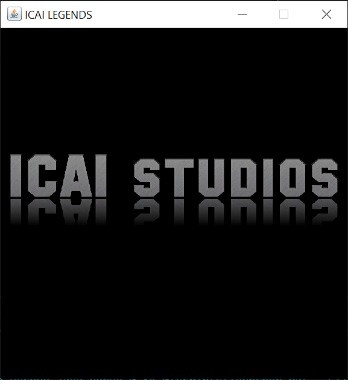

# Práctica Final Programación Orientada a Objetos - Java
### Fernando Pérez Alba

<table>
  <tr>
    <td></td>
    <td></td>
    <td></td>
  </tr>
  <tr>
    <td></td>
    <td></td>
    <td></td>
  </tr>
  <tr>
    <td></td>
    <td></td>
    <td></td>
  </tr>
  <tr>
    <td></td>
    <td></td>
    <td></td>
  </tr>
</table>

## Instrucciones:
En el juego "ICAI LEGENDS" el usuario deberá controlar al jugador para buscar en el tablero 15 prácticas y ganar. Al iniciar el juego lo
primero que se le pedirá será elegir el usuario o crear un usuario nuevo. Se permite un máximo de 5 usuarios y en el fichero proporcionado
"usuarios.csv" ya se han guardado 2 usuarios. Una vez se elija un usuario se le mostrará una pantalla de menú con las opciones de empezar a
jugar, ver las instrucciones o ver el ranking. En el ranking se le mostrará la mejor puntuación de cada usuario. Una vez pulse el botón de
empezar el juego deberá pulsar las flechas para moverse. Pulsando el botón de instrucciones podrá leer más detalles del juego. A lo largo
de la partida, si desea pausarla puede pulsar el botón ESC. Se le abrirá una segunda ventana de pausa que tendrá las opciones de continuar,
reiniciar, ver las instrucciones y volver al menú. Cuando recoja todas las 15 prácticas habrá terminado el juego y si ha conseguido superar
su mejor tiempo se guardará en el fichero "usuarios.csv" como su nuevo record.

## JavaDoc:

Para el javadoc se han comentado las siguiente clases/métodos/atributos:
1) clase Jugador
2) clase Casilla
3) constructor Casilla
4) método importarUsuarios => IOJuego
5) método importarTablero => IOJuego
6) clase JPausa
7) método reproducirSonido => Audio
8) método actualizarPuerta => Tablero
9) atributos Usuario
10) constructor de Herramienta